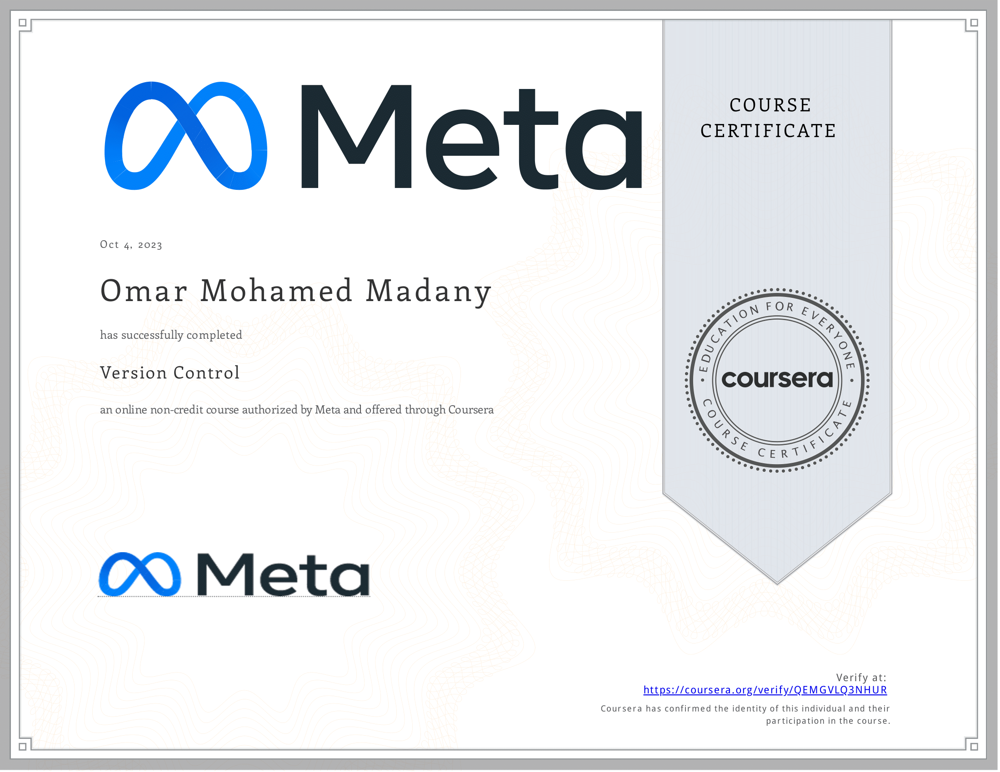

# Course Outline
- Software collaboration
- Command line
- Working with git
- grade assessment

---
## Week 1
- Describe how modern software teams collaborate and work on the same codebase.
- List different version control systems and methodologies.
- Illustrate a standard software development workflow.

## Week 2
- Describe how the command line is and how it is used.
- Practice traversing your hard drive via the command line.
- Create, rename and delete files and folders on your hard drive using Unix commands.
- Use pipes and redirection.

## Week 3
- Outline the Git principles.
- Use a GitHub repository.
- Describe the steps in a standard GitHub workflow.
- Create branches and merge different branches and sources.
- Describe how code goes from local development to version control and then to live production.

## Week 4
- Apply the skills and knowledge from this course on Version Control in a practical assessment